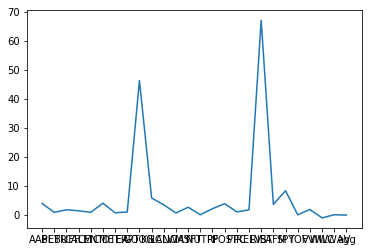

#  Beta Calculator 
## Author : Avnit Bambah
### Date : 03/12/2018
###### Learning ML with python 3 on Pluralsights.
###### Predicting stock beta 


```python
import pandas as pd
import matplotlib as plt
import numpy as np 

# do ploting inline instead of seperate windows 
%matplotlib inline
```


```python
# add new stocks to the csv file 
df = pd.read_csv("./holdings-xlk.csv")
df.shape

```


    (20, 2)


```python
# check if there are any stocks in the csv file 
df.head(10)
```


<div>
<style>
    .dataframe thead tr:only-child th {
        text-align: right;
    }

    .dataframe thead th {
        text-align: left;
    }

    .dataframe tbody tr th {
        vertical-align: top;
    }
</style>
<table border="1" class="dataframe">
  <thead>
    <tr style="text-align: right;">
      <th></th>
      <th>Symbol</th>
      <th>Company Name</th>
    </tr>
  </thead>
  <tbody>
    <tr>
      <th>0</th>
      <td>ANRI</td>
      <td>Amira Nature Food Ltd</td>
    </tr>
    <tr>
      <th>1</th>
      <td>BETR</td>
      <td>NaN</td>
    </tr>
    <tr>
      <th>2</th>
      <td>BUFF</td>
      <td>NaN</td>
    </tr>
    <tr>
      <th>3</th>
      <td>CALM</td>
      <td>NaN</td>
    </tr>
    <tr>
      <th>4</th>
      <td>CENT</td>
      <td>NaN</td>
    </tr>
    <tr>
      <th>5</th>
      <td>DTEA</td>
      <td>NaN</td>
    </tr>
    <tr>
      <th>6</th>
      <td>FRPT</td>
      <td>NaN</td>
    </tr>
    <tr>
      <th>7</th>
      <td>KHC</td>
      <td>NaN</td>
    </tr>
    <tr>
      <th>8</th>
      <td>LANC</td>
      <td>NaN</td>
    </tr>
    <tr>
      <th>9</th>
      <td>LWAY</td>
      <td>NaN</td>
    </tr>
  </tbody>
</table>
</div>


```python
# Define the instruments to download. We would like to see Apple, Microsoft and the S&P500 index in addition to the one in the csv file 
tickers = ['AAPL', 'MSFT', 'SPY','CME','GOOG','VVI','agg']
# get the symbols and add them to the list 
symbols = df.iloc[:,[0]]
array = symbols.values.tolist()
for i in range(1 , len(array)):
    tickers.append(str(array[i]).replace('[\'', '').replace('\']',''))
    
tickers 
```


    ['AAPL',
     'MSFT',
     'SPY',
     'CME',
     'GOOG',
     'VVI',
     'agg',
     'BETR',
     'BUFF',
     'CALM',
     'CENT',
     'DTEA',
     'FRPT',
     'KHC',
     'LANC',
     'LWAY',
     'NUTR',
     'PF',
     'POST',
     'PPC',
     'RELV',
     'RIBT',
     'SAFM',
     'TOF',
     'WILC',
     'WWAV']


```python
import googlefinance
```


```python
from pandas_datareader import data
import pandas as pd

# Define which online source one should use
data_source = 'yahoo'

# We would like all available data from 01/01/2000 until 12/31/2018.
start_date = '2000-01-01'
end_date = '2018-03-24'

# User pandas_reader.data.DataReader to load the desired data. As simple as that.
try:
    panel_data = data.DataReader(tickers, data_source, start_date, end_date)
except:
    print('error in the symbol')
#del panel_data["2017-01-02"]

# Getting just the adjusted closing prices. This will return a Pandas DataFrame
# The index in this DataFrame is the major index of the panel_data.
close = panel_data.loc['Adj Close']

close.dropna(axis=0, how='any')

# Getting all weekdays between start date and end date 
all_weekdays = pd.date_range(start=start_date, end=end_date, freq='B')

# How do we align the existing prices in adj_close with our new set of dates?
# All we need to do is reindex close using all_weekdays as the new index
close = close.reindex(all_weekdays)

close_onedayold = close.shift(-1)
close_onedayold.head(10)

close_final = close - close_onedayold

```


```python
vr = close.corr()
vr.head(10)

```


<div>
<style>
    .dataframe thead tr:only-child th {
        text-align: right;
    }

    .dataframe thead th {
        text-align: left;
    }

    .dataframe tbody tr th {
        vertical-align: top;
    }
</style>
<table border="1" class="dataframe">
  <thead>
    <tr style="text-align: right;">
      <th></th>
      <th>AAPL</th>
      <th>BETR</th>
      <th>BUFF</th>
      <th>CALM</th>
      <th>CENT</th>
      <th>CME</th>
      <th>DTEA</th>
      <th>FRPT</th>
      <th>GOOG</th>
      <th>KHC</th>
      <th>...</th>
      <th>PPC</th>
      <th>RELV</th>
      <th>RIBT</th>
      <th>SAFM</th>
      <th>SPY</th>
      <th>TOF</th>
      <th>VVI</th>
      <th>WILC</th>
      <th>WWAV</th>
      <th>agg</th>
    </tr>
  </thead>
  <tbody>
    <tr>
      <th>AAPL</th>
      <td>1.000000</td>
      <td>-0.669186</td>
      <td>0.650407</td>
      <td>0.936062</td>
      <td>0.684971</td>
      <td>0.915372</td>
      <td>-0.703757</td>
      <td>0.593848</td>
      <td>0.956831</td>
      <td>0.185599</td>
      <td>...</td>
      <td>0.443312</td>
      <td>-0.486193</td>
      <td>-0.519303</td>
      <td>0.937320</td>
      <td>0.965438</td>
      <td>NaN</td>
      <td>0.708511</td>
      <td>-0.493247</td>
      <td>NaN</td>
      <td>0.887378</td>
    </tr>
    <tr>
      <th>BETR</th>
      <td>-0.669186</td>
      <td>1.000000</td>
      <td>-0.078369</td>
      <td>0.308227</td>
      <td>-0.581386</td>
      <td>-0.588406</td>
      <td>0.747871</td>
      <td>-0.505143</td>
      <td>-0.555503</td>
      <td>-0.119124</td>
      <td>...</td>
      <td>-0.417232</td>
      <td>-0.247830</td>
      <td>0.410661</td>
      <td>-0.637428</td>
      <td>-0.556837</td>
      <td>NaN</td>
      <td>-0.664139</td>
      <td>NaN</td>
      <td>NaN</td>
      <td>-0.140608</td>
    </tr>
    <tr>
      <th>BUFF</th>
      <td>0.650407</td>
      <td>-0.078369</td>
      <td>1.000000</td>
      <td>-0.248258</td>
      <td>0.635458</td>
      <td>0.797233</td>
      <td>-0.531502</td>
      <td>0.716681</td>
      <td>0.698244</td>
      <td>0.069239</td>
      <td>...</td>
      <td>0.598517</td>
      <td>-0.015995</td>
      <td>-0.159265</td>
      <td>0.587096</td>
      <td>0.758926</td>
      <td>NaN</td>
      <td>0.631657</td>
      <td>-0.939039</td>
      <td>NaN</td>
      <td>0.502931</td>
    </tr>
    <tr>
      <th>CALM</th>
      <td>0.936062</td>
      <td>0.308227</td>
      <td>-0.248258</td>
      <td>1.000000</td>
      <td>0.544791</td>
      <td>0.832050</td>
      <td>0.289356</td>
      <td>-0.265112</td>
      <td>0.887796</td>
      <td>-0.731628</td>
      <td>...</td>
      <td>0.407775</td>
      <td>-0.467830</td>
      <td>-0.547360</td>
      <td>0.878630</td>
      <td>0.906301</td>
      <td>NaN</td>
      <td>0.548055</td>
      <td>-0.270749</td>
      <td>NaN</td>
      <td>0.878670</td>
    </tr>
    <tr>
      <th>CENT</th>
      <td>0.684971</td>
      <td>-0.581386</td>
      <td>0.635458</td>
      <td>0.544791</td>
      <td>1.000000</td>
      <td>0.736442</td>
      <td>-0.835450</td>
      <td>0.045755</td>
      <td>0.690549</td>
      <td>0.527623</td>
      <td>...</td>
      <td>0.604939</td>
      <td>0.022598</td>
      <td>-0.084792</td>
      <td>0.753446</td>
      <td>0.703491</td>
      <td>NaN</td>
      <td>0.865030</td>
      <td>-0.485567</td>
      <td>NaN</td>
      <td>0.348493</td>
    </tr>
    <tr>
      <th>CME</th>
      <td>0.915372</td>
      <td>-0.588406</td>
      <td>0.797233</td>
      <td>0.832050</td>
      <td>0.736442</td>
      <td>1.000000</td>
      <td>-0.813358</td>
      <td>0.301428</td>
      <td>0.958832</td>
      <td>0.221677</td>
      <td>...</td>
      <td>0.515731</td>
      <td>-0.451223</td>
      <td>-0.287172</td>
      <td>0.900730</td>
      <td>0.957320</td>
      <td>NaN</td>
      <td>0.886091</td>
      <td>-0.413933</td>
      <td>NaN</td>
      <td>0.748169</td>
    </tr>
    <tr>
      <th>DTEA</th>
      <td>-0.703757</td>
      <td>0.747871</td>
      <td>-0.531502</td>
      <td>0.289356</td>
      <td>-0.835450</td>
      <td>-0.813358</td>
      <td>1.000000</td>
      <td>-0.057489</td>
      <td>-0.858145</td>
      <td>-0.300839</td>
      <td>...</td>
      <td>-0.474996</td>
      <td>0.288723</td>
      <td>0.624573</td>
      <td>-0.798169</td>
      <td>-0.806289</td>
      <td>NaN</td>
      <td>-0.846973</td>
      <td>0.249263</td>
      <td>NaN</td>
      <td>-0.655630</td>
    </tr>
    <tr>
      <th>FRPT</th>
      <td>0.593848</td>
      <td>-0.505143</td>
      <td>0.716681</td>
      <td>-0.265112</td>
      <td>0.045755</td>
      <td>0.301428</td>
      <td>-0.057489</td>
      <td>1.000000</td>
      <td>0.061231</td>
      <td>0.072662</td>
      <td>...</td>
      <td>0.473951</td>
      <td>0.602256</td>
      <td>0.470791</td>
      <td>0.345904</td>
      <td>0.393145</td>
      <td>NaN</td>
      <td>0.221741</td>
      <td>-0.376312</td>
      <td>NaN</td>
      <td>-0.035979</td>
    </tr>
    <tr>
      <th>GOOG</th>
      <td>0.956831</td>
      <td>-0.555503</td>
      <td>0.698244</td>
      <td>0.887796</td>
      <td>0.690549</td>
      <td>0.958832</td>
      <td>-0.858145</td>
      <td>0.061231</td>
      <td>1.000000</td>
      <td>0.244621</td>
      <td>...</td>
      <td>0.400323</td>
      <td>-0.627298</td>
      <td>-0.405371</td>
      <td>0.940656</td>
      <td>0.971929</td>
      <td>NaN</td>
      <td>0.790159</td>
      <td>-0.402471</td>
      <td>NaN</td>
      <td>0.836116</td>
    </tr>
    <tr>
      <th>KHC</th>
      <td>0.185599</td>
      <td>-0.119124</td>
      <td>0.069239</td>
      <td>-0.731628</td>
      <td>0.527623</td>
      <td>0.221677</td>
      <td>-0.300839</td>
      <td>0.072662</td>
      <td>0.244621</td>
      <td>1.000000</td>
      <td>...</td>
      <td>0.200496</td>
      <td>0.084573</td>
      <td>-0.690083</td>
      <td>0.298551</td>
      <td>0.312467</td>
      <td>NaN</td>
      <td>0.360078</td>
      <td>-0.385210</td>
      <td>NaN</td>
      <td>0.605116</td>
    </tr>
  </tbody>
</table>
<p>10 rows × 26 columns</p>
</div>


```python
covar = close_final.cov()
covar.head(10)

```


<div>
<style>
    .dataframe thead tr:only-child th {
        text-align: right;
    }

    .dataframe thead th {
        text-align: left;
    }

    .dataframe tbody tr th {
        vertical-align: top;
    }
</style>
<table border="1" class="dataframe">
  <thead>
    <tr style="text-align: right;">
      <th></th>
      <th>AAPL</th>
      <th>BETR</th>
      <th>BUFF</th>
      <th>CALM</th>
      <th>CENT</th>
      <th>CME</th>
      <th>DTEA</th>
      <th>FRPT</th>
      <th>GOOG</th>
      <th>KHC</th>
      <th>...</th>
      <th>PPC</th>
      <th>RELV</th>
      <th>RIBT</th>
      <th>SAFM</th>
      <th>SPY</th>
      <th>TOF</th>
      <th>VVI</th>
      <th>WILC</th>
      <th>WWAV</th>
      <th>agg</th>
    </tr>
  </thead>
  <tbody>
    <tr>
      <th>AAPL</th>
      <td>0.790129</td>
      <td>0.082299</td>
      <td>0.149833</td>
      <td>0.063228</td>
      <td>0.037944</td>
      <td>0.240610</td>
      <td>0.025684</td>
      <td>0.134653</td>
      <td>3.181668</td>
      <td>0.583230</td>
      <td>...</td>
      <td>0.035921</td>
      <td>0.018094</td>
      <td>0.093943</td>
      <td>0.120666</td>
      <td>0.531436</td>
      <td>NaN</td>
      <td>0.090070</td>
      <td>-0.475934</td>
      <td>NaN</td>
      <td>-0.019480</td>
    </tr>
    <tr>
      <th>BETR</th>
      <td>0.082299</td>
      <td>0.151804</td>
      <td>0.042721</td>
      <td>0.038721</td>
      <td>0.021515</td>
      <td>0.041686</td>
      <td>0.008618</td>
      <td>0.017510</td>
      <td>0.433829</td>
      <td>0.038860</td>
      <td>...</td>
      <td>0.024728</td>
      <td>0.009556</td>
      <td>-0.000227</td>
      <td>0.074199</td>
      <td>0.162904</td>
      <td>NaN</td>
      <td>0.018389</td>
      <td>NaN</td>
      <td>NaN</td>
      <td>0.000018</td>
    </tr>
    <tr>
      <th>BUFF</th>
      <td>0.149833</td>
      <td>0.042721</td>
      <td>0.296293</td>
      <td>0.078403</td>
      <td>0.050069</td>
      <td>0.136931</td>
      <td>0.019553</td>
      <td>0.044157</td>
      <td>0.999974</td>
      <td>0.107708</td>
      <td>...</td>
      <td>0.038858</td>
      <td>-0.005401</td>
      <td>-0.000076</td>
      <td>0.157119</td>
      <td>0.300523</td>
      <td>NaN</td>
      <td>0.043564</td>
      <td>-0.028433</td>
      <td>NaN</td>
      <td>-0.001000</td>
    </tr>
    <tr>
      <th>CALM</th>
      <td>0.063228</td>
      <td>0.038721</td>
      <td>0.078403</td>
      <td>0.245597</td>
      <td>0.023966</td>
      <td>0.106906</td>
      <td>0.043064</td>
      <td>0.034162</td>
      <td>0.572838</td>
      <td>0.197657</td>
      <td>...</td>
      <td>0.037489</td>
      <td>0.009377</td>
      <td>0.130481</td>
      <td>0.127632</td>
      <td>0.176874</td>
      <td>NaN</td>
      <td>0.056064</td>
      <td>0.001833</td>
      <td>NaN</td>
      <td>-0.007287</td>
    </tr>
    <tr>
      <th>CENT</th>
      <td>0.037944</td>
      <td>0.021515</td>
      <td>0.050069</td>
      <td>0.023966</td>
      <td>0.109393</td>
      <td>0.059475</td>
      <td>0.009189</td>
      <td>0.021278</td>
      <td>0.430200</td>
      <td>0.130463</td>
      <td>...</td>
      <td>0.017991</td>
      <td>0.014651</td>
      <td>0.088006</td>
      <td>0.050558</td>
      <td>0.122808</td>
      <td>NaN</td>
      <td>0.046862</td>
      <td>-0.043566</td>
      <td>NaN</td>
      <td>-0.004589</td>
    </tr>
    <tr>
      <th>CME</th>
      <td>0.240610</td>
      <td>0.041686</td>
      <td>0.136931</td>
      <td>0.106906</td>
      <td>0.059475</td>
      <td>0.903754</td>
      <td>0.039096</td>
      <td>0.052095</td>
      <td>2.452420</td>
      <td>0.303425</td>
      <td>...</td>
      <td>0.064926</td>
      <td>0.071860</td>
      <td>0.500329</td>
      <td>0.258598</td>
      <td>0.718576</td>
      <td>NaN</td>
      <td>0.156010</td>
      <td>-0.074899</td>
      <td>NaN</td>
      <td>-0.050366</td>
    </tr>
    <tr>
      <th>DTEA</th>
      <td>0.025684</td>
      <td>0.008618</td>
      <td>0.019553</td>
      <td>0.043064</td>
      <td>0.009189</td>
      <td>0.039096</td>
      <td>0.516684</td>
      <td>0.015549</td>
      <td>0.130587</td>
      <td>0.040208</td>
      <td>...</td>
      <td>0.030699</td>
      <td>0.005369</td>
      <td>-0.000660</td>
      <td>0.055836</td>
      <td>0.081862</td>
      <td>NaN</td>
      <td>0.015638</td>
      <td>0.006917</td>
      <td>NaN</td>
      <td>-0.002265</td>
    </tr>
    <tr>
      <th>FRPT</th>
      <td>0.134653</td>
      <td>0.017510</td>
      <td>0.044157</td>
      <td>0.034162</td>
      <td>0.021278</td>
      <td>0.052095</td>
      <td>0.015549</td>
      <td>0.181723</td>
      <td>0.525317</td>
      <td>0.079710</td>
      <td>...</td>
      <td>0.021344</td>
      <td>-0.000301</td>
      <td>0.000956</td>
      <td>0.061030</td>
      <td>0.161315</td>
      <td>NaN</td>
      <td>0.026143</td>
      <td>-0.031250</td>
      <td>NaN</td>
      <td>-0.006066</td>
    </tr>
    <tr>
      <th>GOOG</th>
      <td>3.181668</td>
      <td>0.433829</td>
      <td>0.999974</td>
      <td>0.572838</td>
      <td>0.430200</td>
      <td>2.452420</td>
      <td>0.130587</td>
      <td>0.525317</td>
      <td>49.505934</td>
      <td>4.192031</td>
      <td>...</td>
      <td>0.358821</td>
      <td>0.200331</td>
      <td>0.763855</td>
      <td>1.206816</td>
      <td>5.706095</td>
      <td>NaN</td>
      <td>0.896629</td>
      <td>-0.846947</td>
      <td>NaN</td>
      <td>-0.088129</td>
    </tr>
    <tr>
      <th>KHC</th>
      <td>0.583230</td>
      <td>0.038860</td>
      <td>0.107708</td>
      <td>0.197657</td>
      <td>0.130463</td>
      <td>0.303425</td>
      <td>0.040208</td>
      <td>0.079710</td>
      <td>4.192031</td>
      <td>0.968436</td>
      <td>...</td>
      <td>0.132981</td>
      <td>0.004113</td>
      <td>-0.003645</td>
      <td>0.443165</td>
      <td>0.884554</td>
      <td>NaN</td>
      <td>0.111313</td>
      <td>-0.055900</td>
      <td>NaN</td>
      <td>0.009923</td>
    </tr>
  </tbody>
</table>
<p>10 rows × 26 columns</p>
</div>


```python
market_temp = close_final.iloc[:,[20]]
market = market_temp.dropna()

```


```python
#total = sum(market)
mean_value = pd.DataFrame.mean(market)
print(mean_value)
variance = pd.DataFrame.var(market)
print(variance)
market.head(10)
```

    SPY   -0.031624
    dtype: float64
    SPY    1.696072
    dtype: float64


<div>
<style>
    .dataframe thead tr:only-child th {
        text-align: right;
    }

    .dataframe thead th {
        text-align: left;
    }

    .dataframe tbody tr th {
        vertical-align: top;
    }
</style>
<table border="1" class="dataframe">
  <thead>
    <tr style="text-align: right;">
      <th></th>
      <th>SPY</th>
    </tr>
  </thead>
  <tbody>
    <tr>
      <th>2000-01-03</th>
      <td>4.043312</td>
    </tr>
    <tr>
      <th>2000-01-04</th>
      <td>-0.177711</td>
    </tr>
    <tr>
      <th>2000-01-05</th>
      <td>1.599548</td>
    </tr>
    <tr>
      <th>2000-01-06</th>
      <td>-5.687286</td>
    </tr>
    <tr>
      <th>2000-01-07</th>
      <td>-0.355492</td>
    </tr>
    <tr>
      <th>2000-01-10</th>
      <td>1.244125</td>
    </tr>
    <tr>
      <th>2000-01-11</th>
      <td>1.021920</td>
    </tr>
    <tr>
      <th>2000-01-12</th>
      <td>-1.377381</td>
    </tr>
    <tr>
      <th>2000-01-13</th>
      <td>-1.399566</td>
    </tr>
    <tr>
      <th>2000-01-18</th>
      <td>-0.844230</td>
    </tr>
  </tbody>
</table>
</div>


```python
covartotal = pd.DataFrame.sum(covar)
print(covartotal)
print(variance[[0][0]])

```

    AAPL      6.608920
    BETR      1.396304
    BUFF      2.885049
    CALM      2.303075
    CENT      1.431950
    CME       6.751351
    DTEA      1.151857
    FRPT      1.606855
    GOOG     78.410438
    KHC       9.805761
    LANC      5.773939
    LWAY      1.027115
    MSFT      4.401080
    NUTR      0.000000
    PF        3.541414
    POST      6.455729
    PPC       1.682447
    RELV      2.842821
    RIBT    113.662828
    SAFM      6.067782
    SPY      14.028377
    TOF       0.000000
    VVI       3.045391
    WILC     -1.852250
    WWAV      0.000000
    agg      -0.205133
    dtype: float64
    1.69607197374


```python
beta_appl = (covartotal/variance[[0][0]])

```


```python
beta_appl.head(100)
```


    AAPL     3.896603
    BETR     0.823258
    BUFF     1.701018
    CALM     1.357888
    CENT     0.844274
    CME      3.980580
    DTEA     0.679132
    FRPT     0.947398
    GOOG    46.230608
    KHC      5.781453
    LANC     3.404301
    LWAY     0.605585
    MSFT     2.594866
    NUTR     0.000000
    PF       2.088009
    POST     3.806282
    PPC      0.991967
    RELV     1.676120
    RIBT    67.015333
    SAFM     3.577550
    SPY      8.271098
    TOF      0.000000
    VVI      1.795555
    WILC    -1.092082
    WWAV     0.000000
    agg     -0.120946
    dtype: float64


```python
import matplotlib.pyplot as plt
plt.plot(beta_appl)
```


    [<matplotlib.lines.Line2D at 0x1156074a8>]




